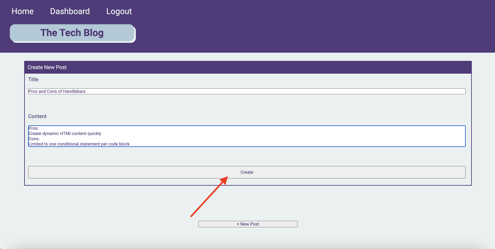

# Tech Blog

## Description
Building this blog was an exciting and challenging project to test my full stack web development skills. It helped me combine and put context to all of the skills I've learned so far.
It is rewarding to see everything come together as a functional web application! This project taught me:
* How to utilize the MVC framework
* How to set up an SQL database
* How to use express.js to create RESTful APIs
* How to differentiate front end and back end routes
* How to use express.session to set up a user session and cookies
* How to implement a templating language, in this case Handlebars, for HTML
* How to use Sequelize to create models
* How to use Sequelize for database querying, ie creating, reading, updating and deleting data
* How to seed the database
* How to deploy the backend to Heroku
* How to write front end logic to interact with the back end, ie fetching data 
* and more

## Installation
Use npm i to install dependencies below.

bcrypt: https://www.npmjs.com/package/bcrypt

MySQL: https://www.npmjs.com/package/mysql2

Express: https://www.npmjs.com/package/express

Express Session: https://www.npmjs.com/package/express-session

Sequelize: https://www.npmjs.com/package/sequelize

Connect Session Store Sequelize: https://www.npmjs.com/package/connect-session-sequelize

dotenv: https://www.npmjs.com/package/dotenv

Handlebars: https://www.npmjs.com/package/handlebars

## Usage
In order to create a blog post, first create an account. From there, click the 'New Post' button on the dashboard, fill out the form pictured, and click the 'Create' button.

## Credits
Sequelize Documentation: https://sequelize.org/

Handlebars Documentation: https://handlebarsjs.com/guide/#what-is-handlebars

## License
n/a